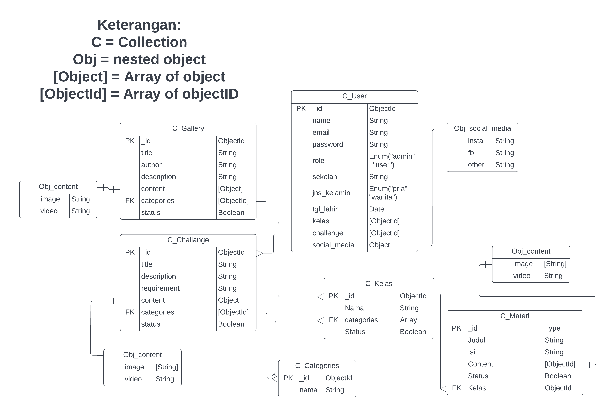

# Web Service & RESTful API Sereal Application by BE-16

## Built With

- express.js
- mongodb
- mongoose
- jsonwebtoken (jwt)
- bcrypt

## ERD



## Deploy Site

- [[https://sereal-be-testing.up.railway.app]]

## API Documentation

- [Open API spesification file](/api/sereal.json)
  atau lewat swagger hub
- [Swagger Hub sereal api spesification]()

## APIs Specification

- **Base URL API** : [[https://sereal-be-testing.up.railway.app/]]

### Authentication

There are two roles: **user** and **admin**.
As **user**, you can register, login and use almost all API GET method. As **admin**, you can use all API available.

To use API as **admin**, first **register** yourself and then **contact** developers to change your role.

To use API as **admin**, use this :
Request:

- Header:
  - x-access-token : "your unique jwt token"
- and other additional headers depend on the usecase

Otherwise you will get:

- Response:
- status code: **403**

```json
{
    "A token is required for authorization"
}
```

### Register
Request:
- Method : **POST**
- Endpoint : `/register`
- Header:
  - Content-Type: application/json
  - Accept: application/json
  - x-access-token = "token"
- Body :

```json
{
  "name": "string, length> 0",
  "email": "string, must have @, length >3",
  "password": "string, length> 0"
}
```

Response:
- status code: **201**

```json
{
  "message": "string"
}
```

- status code: **406**

```json
{
  "message": "string"
}
```

- status code: **500**

```json
{
  "message": "string",
  "error": "string",
}
```

### Login
Request:
- Method : POST
- Endpoint : /login
- Body :

```json
{
  "email": "string, must have @",
  "password": "string"
}
```

Response:
- status code: **200**

```json
{
  "message": "string",
  "token": "string"
}
```

- status code: **404**

```json
{
  "message": "string"
}
```

- status code: **400**

```json
{
  "message": "string"
}
```

- status code: **500**

```json
{
  "message": "string",
  "error": "string"
}
```

### Materi

#### Get All Materi

Request :

- Method: **GET**
- Endpoint: `/materi `
- Header:
  - Accept:application/json

Response :

- Status code: **200**

```json
{
    "massage":"string",
    "data":[
        {
            "id":"string, unique",
            "title":"string",
            "body":"string",
            "content":{
                "image":["string, link"],
                "video":["string, link"]
            },
            "status":"Boolean"
        },
        {
            "id":"string, unique",
            "title":"string",
            "body":"string",
            "content":{
                "image":["string, link"],
                "video":["string, link"]
            },
            "status":"Boolean"
        }
    ]
}
```

- Status code: **500**

```json
{
  "message": "string",
  "error": "string"
}
```

#### Get Materi by ID

Request :

- Method: **GET**
- Endpoint: `/materi/{materi_id}`
- Header:
  - Accept:application/json

Response:

- Status code: **200**

```json
{
    "massage":"string",
    "data":{
            "id":"string, unique",
            "title":"string",
            "body":"string",
            "content":{
                "image":["string, link"],
                "video":["string, link"]
            },
            "status":"Boolean"
    }

}
```

- Status code: **400**

```json
{
  "message": "string"
}
```

#### Create Materi

Request :

- Method: **POST**
- Endpoint: `/materi`
- Header:
  - Content-Type:application/json
  - Accept:application/json
  - x-access-token = "token"
- Body:

```json
{
    "id":"string, unique",
    "title":"string",
    "body":"string",
    "content":{
        "image":["string, link"],"video":["string, link"]
    },
    "status":"Boolean"
}
```

Response:

- Status code: **201**

```json
{
  "message": "string"
}
```

- Status code: **500**

```json
{
  "message": "string",
  "error": "string"
}
```

#### Update Materi

Request :

- Method: **PATCH**
- Endpoint: `/materi/{materi_id}`
- Header:
  - Content-Type:application/json
  - Accept:application/json
  - x-access-token = "token"
- Body:

```json
{
    "title":"string",
    "body":"string",
    "content":{
      "image":["string, link"],
      "video":["string, link"]
    },
    "status":"Boolean"
}
```

Responses:

- Status code: **201**

```json
{
  "message": "string"
}
```

- Status code: **500**

```json
{
  "message": "string",
  "error": "string"
}
```

#### Delete Materi

Request :

- Method: **Delete**
- Endpoint: `/materi/{materi_id}`
- Header:
  - Accept:application/json
  - x-access-token = "token"

Response:

- Status code: **200**

```json
{
  "message": "string"
}
```

- Status code: **404**

```json
{
  "message": "string",
  "error": "string"
}
```

### Kelas

#### Get All Kelas

Request :

- Method: **GET**
- Endpoint: `/kelas `
- Header:
  - Accept:application/json

Response :

- Status code: **200**

```json
{
    "massage":"string",
    "data":[
        {
            "id":"string, unique",
            "title":"string",
            "description":"string",
            "materi":[
              {
                  "id":"string, unique",
                  "title":"string",
                  "body":"string",
                  "content":{
                    "image":["string", "link"],
                    "video":["string, link"]
                  },
                  "status":"Boolean"
              },
              {
                  "id":"string, unique",
                  "title":"string",
                  "body":"string",
                  "content":{
                      "image":["string", "link"],
                      "video":["string, link"]
                  },
                  "status":"Boolean"
              }
            ],
            "categories":[
              {
                "id":"string, unique",
                "name":"string"
              },
              {
                "id":"string, unique",
                "name":"string"
              }
            ],
            "level":"string",
            "status":"Boolean"
        },
        {
            "id":"string, unique",
            "title":"string",
            "description":"string",
            "materi":[
              {
                  "id":"string, unique",
                  "title":"string",
                  "body":"string",
                  "content":{
                      "image":["string", "link"],
                      "video":["string, link"]
                  },
                  "status":"Boolean"
              },
              {
                  "id":"string, unique",
                  "title":"string",
                  "body":"string",
                  "content":{
                      "image":"[string]",
                      "video":"[string]"
                  },
                  "level":"string",
                  "status":"Boolean"
              }
            ],
            "categories":[
              {
                "id":"string, unique",
                "name":"string"
              },
              {
                "id":"string, unique",
                "name":"string"
              }
            ],
            "level":"string",
            "status":"Boolean"
        }
    ]
}
```

- Status code: **500**

```json
{
  "message": "string",
  "error": "string"
}
```

#### Get Kelas by ID

Request :

- Method: **GET**
- Endpoint: `/kelas/{kelas_id}`
- Header:
  - Accept:application/json

Response:

- Status code: **200**

```json
{
    "massage":"string",
    "data":{
            "id":"string, unique",
            "title":"string",
            "description":"string",
            "materi":[
              {
                  "id":"string, unique",
                  "title":"string",
                  "body":"string",
                  "content":{
                      "image":["string", "link"],
                      "video":["string, link"]
                  },
                  "status":"Boolean"
              },
              {
                  "id":"string, unique",
                  "title":"string",
                  "body":"string",
                  "content":{
                      "image":["string", "link"],
                      "video":["string, link"]
                  },
                  "status":"Boolean"
              }
            ],
            "categories":[
              {
                "id":"string, unique",
                "name":"string"
              },
              {
                "id":"string, unique",
                "name":"string"
              }
            ],
            "level":"string",
            "status": "Boolean"
        }

}
```

- Status code: **400**

```json
{
  "message": "string"
}
```

#### Create Kelas

Request :

- Method: **POST**
- Endpoint: `/kelas`
- Header:
  - Content-Type:application/json
  - Accept:application/json
  - x-access-token = "token"
- Body:

```json
{
    "title":"string",
    "description":"string",
    "materi":["objectID"],
    "categories":["objectID"],
    "level":"string",
    "status": "Boolean"
}
```

Response:

- Status code: **201**

```json
{
  "message": "string"
}
```

- Status code: **500**

```json
{
  "message": "string",
  "error": "string"
}
```

#### Update Kelas

Request :

- Method: **PATCH**
- Endpoint: `/kelas/{kelas_id}`
- Header:
  - Content-Type:application/json
  - Accept:application/json
- Body:

```json
{
    "title":"string",
    "description":"string",
    "materi":["objectID"],
    "categories":["objectID"],
    "level":"string",
    "status":"Boolean"
}
```

Responses:

- Status code: **201**

```json
{
  "message": "string"
}
```

- Status code: **500**

```json
{
  "message": "string",
  "error": "string"
}
```

#### Delete Kelas

Request :

- Method: **Delete**
- Endpoint: `/kelas/{kelas_id}`
- Header:
  - Accept:application/json
  - x-access-token = "token"

Response:

- Status code: **200**

```json
{
  "message": "string"
}
```

- Status code: **404**

```json
{
  "message": "string",
  "error": "string"
}
```

### Gallery

#### Get All Gallery
Request:

- Method: **GET**
- Endpoint: `/gallery`
- Header:
  - Accept: application/json
  - x-access-token : `token`

Response:
- status code: **200**
```json
{
  "message": "Success get all gallery",
  "data": [
    {
      "_id": "string, unique",
      "title": "string, min length",
      "author": "string",
      "description": "string",
      "categories": [
        {
          "_id": "string, unique",
          "name": "string"
        }
      ],
      "status": "Boolean"
    }
  ]
}
```
- status code: **500**
```json
{
  "message": "string",
  "error": "string"
}
```
#### Get Gallery by ID
Request:

- Method: **GET**
- Endpoint: `/gallery`
- Header:
  - Accept: application/json
  - x-access-token : `token`

Response:
- status code: **200**
```json
{
  "message": "string",
  "data": {
    "_id": "string, unique",
    "title": "string",
    "author": "string",
    "description": "string",
    "categories": [
      "categories_id"
    ]}
}
```
- status code: **400**
```json
{
  "message": "string"
}
```
- status code: **404**

```json
{
  "message": "string"
}
```
- status code: **500**

```json
{
  "message": "string",
  "data": "string"
}
```
#### Create Gallery

#### Update Gallery by ID

#### Delete Gallery by ID

### Users

#### Get All User
Request:

- Method: **GET**
- Endpoint: `/users`
- Header:
  - Accept: application/json
  - x-access-token : `token`

Response:

- status code: **200**
```json
{
  "message": "string",
  "data": [
    {
      "_id": "string",
      "email": "string, must have @",
      "role": "user||admin",
      "sekolah": "string",
      "jns_kelamin":"pria||wanita",
      "kelas": ["kelas_id", "kelas_id"],
      "challenge": ["challenge_id", "challenge_id"],
      "social_media": {
        "insta": "string",
        "fb": "string",
        "other": "string"
      },
      "updatedAt": "dateAndTimezone"
    }
  ]
}
```

- status code: **500**

```json
{
  "message": "string",
  "error": "string"
}
```

#### Get User by ID

Request:

- Method: **GET**
- Endpoint: `/users/{user_id}`
- Header:
  - Accept: application/json
  - x-access-token : `token`

Response:

- status code: **200**

```json
{
"message": "string",
  "data": [
    {
      "_id": "string",
      "email": "string, must have @",
      "role": "user||admin",
      "sekolah": "string",
      "jns_kelamin":"pria||wanita",
      "kelas": [{
        "_id": "string, unique",
        "title": "string",
        "image": "string, link",
        "level": "string",
        "status": "Boolean"
      }],
      "challenge": [{
        "_id": "6379e9da860e53a54a26f3f1",
        "title": "Design Poster Digital",
        "content": {
          "image": ["string, link"]
        },
        "requirement": "string",
        "status": "Boolean"
      }],
      "social_media": {
        "insta": "string",
        "fb": "string",
        "other": "string"
      },
      "updatedAt": "dateAndTimezone"
    }
  ]
}
```
- status code: **400**
```json
{
  "message": "string"
}
```
- status code: **404**

```json
{
  "message": "string"
}
```
- status code: **500**

```json
{
  "message": "string",
  "data": "string"
}
```

#### Update User by ID

Request:

- Method: **PATCH**
- Endpoint: `/kelas/{kelas_id}`
- Header:
  - Content-Type: application/json
  - Accept: application/json
  - x-access-token : `token`
- Body:
```json
{
  "name":"string",
  "email": "string, must have @, unique",
  "password":"string",
  "role": "user||admin",
  "sekolah": "string",
  "tgl_lahir":"yyyy-mm-dd",
  "jns_kelamin": "pria||wanita",
  "kelas": ["kelas_id", "kelas_id"],
  "challenge": ["challenge_id"],
  "social_media": {
    "insta": "string",
    "fb": "string",
    "other":"string"
  }
}
```

Response:
- status code: **200**
```json
{
  "message": "string",
  "data": {
    "name":"string",
    "email": "string, must have @, unique",
    "password":"string",
    "role": "user||admin",
    "sekolah": "string",
    "tgl_lahir":"yyyy-mm-dd",
    "jns_kelamin": "pria||wanita",
    "kelas": ["kelas_id", "kelas_id"],
    "challenge": ["challenge_id"],
    "social_media": {
      "insta": "string",
      "fb": "string",
      "other":"string"
  }}
}
```
- status code: **400**
```json
{
  "message": "string"
}
```
- status code: **404**

```json
{
  "message": "string"
}
```
- status code: **500**

```json
{
  "message": "string",
  "error": "string"
}
```

#### Delete User by ID
Request:

- Method: **PATCH**
- Endpoint: `/kelas/{kelas_id}`
- Header:
  - Accept: application/json
  - x-access-token : `token`

Response:
- status code: **200**
```json
{
  "message": "string"
}
```
- status code: **400**
```json
{
  "message": "string"
}
```
- status code: **404**

```json
{
  "message": "string"
}
```
- status code: **500**

```json
{
  "message": "string",
  "data": "string"
}
```